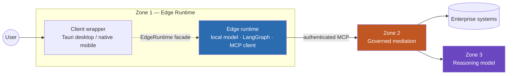

# Sovereign Agentic Architecture

[Zone 1 — Edge Runtime](https://github.com/CharlieAtki06/SovereignAgenticArchitectureZoneOne) · [Zone 2 — Governed Layer](https://github.com/CharlieAtki06/SovereignAgenticArchitectureZoneTwo) · [ADRs](docs/adr/README.md) · [Contributing](CONTRIBUTING.md)

---

## Introduction

### The problem this architecture solves

Enterprise AI applications have a fundamental tension: the AI model needs access to sensitive data to be useful, but giving it unrestricted access is unsafe, unauditable, and non-compliant. You cannot explain what the model accessed, why, or whether it was authorised to do so.

The three-zone architecture resolves this by separating three distinct concerns into three distinct layers, each with a clear and limited responsibility. The governance layer — Zone 2 — is the only path to enterprise data. Every request is authenticated, policy-evaluated, and recorded before any data moves.

---

## The three zones

**Zone 1 — the edge runtime**
A lightweight, local function-calling model running inside a LangGraph agentic framework. Its job is to understand what the user wants and translate it into a structured, governed request. It cannot access data directly. Every capability it invokes goes through Zone 2's MCP server.

**Zone 2 — the governance and mediation layer**
The gatekeeper. Authenticates callers, evaluates policy deterministically, records every decision to an immutable audit log, executes the appropriate enterprise connector, and strips responses to only the fields the caller is permitted to see. The sole source of truth for which capabilities and MCP Apps exist.

**Zone 3 — the reasoning model and enterprise data sources**
The large reasoning LLM and the enterprise data sources it orchestrates (FHIR APIs, SQL databases, third-party services). Only reachable through Zone 2's connector boundary — never directly from Zone 1.



**The boundary that must never be crossed:** Zone 1 consumes Zone 2 exclusively through its published MCP interface. Zone 1 must never import Zone 2 source code, call Zone 2's internal Python functions, or bypass the MCP transport for any reason.

---

## Repository structure

This architecture spans three repositories:

| Repository | Purpose |
|---|---|
| [SovereignAgenticArchitecture](https://github.com/CharlieAtki06/SovereignAgenticArchitecture) | This repo. VS Code workspace, cross-zone docs, onboarding. |
| [SovereignAgenticArchitectureZoneOne](https://github.com/CharlieAtki06/SovereignAgenticArchitectureZoneOne) | Edge runtime: local model, LangGraph, MCP client, Tauri desktop shell, native mobile (planned). |
| [SovereignAgenticArchitectureZoneTwo](https://github.com/CharlieAtki06/SovereignAgenticArchitectureZoneTwo) | Governed mediation: policy engine, audit, connectors, MCP server. |

Each zone retains its own `.git`, CI pipeline, dependencies, and releases. This is not a monorepo.

---

## Getting started

### Prerequisites

- Git
- [uv](https://docs.astral.sh/uv/) (Zone 2 Python toolchain)
- Docker or Podman (Zone 2 infrastructure)

### Setup

```bash
git clone https://github.com/CharlieAtki06/SovereignAgenticArchitecture.git
cd SovereignAgenticArchitecture
./setup.sh
```

`setup.sh` clones Zone 1 and Zone 2 as siblings and opens the VS Code workspace. After it completes, your directory layout will be:

```
Dev/
├── SovereignAgenticArchitecture/          ← this repo (root envelope)
│   └── SovereignAgenticArchitecture.code-workspace
├── SovereignAgenticArchitectureZoneOne/   ← Zone 1
│   └── SovereignAgenticArchitectureZoneOne/
└── Sovereign-Agentic-Architecture/        ← Zone 2
    └── SovereignAgenticArchitectureZoneTwo/
```

Open `SovereignAgenticArchitecture.code-workspace` in VS Code to see both zones together.

### Running Zone 2 locally

```bash
cd ../Sovereign-Agentic-Architecture/SovereignAgenticArchitectureZoneTwo
make install
make db-up
make migrate
make dev       # API on http://localhost:8000
```

### Running the full system (both zones)

For the normal interactive application, start a named **desktop** profile from
this root workspace. The command selects Zone 2's realm/module compose overlay,
then launches the desktop with its own local Zone 1 sidecar:

```bash
make desktop-up-nhs
# sign in as clinician-a / password
```

Use `make desktop-up-infrastructure` for the synthetic Northstar example. Only
one profile can use the normal local ports at a time. Stop the matching profile
with `make desktop-down-nhs` or `make desktop-down-infrastructure`.

For the complete lifecycle—source rebuilds, realm resets, worker logs, CLI
testing, and the distinction between desktop and headless paths—use the
[local demo runbook](docs/dev/local-demo-runbook.md).

The optional headless path is for testing the containerised generic Zone 1 edge
and CLI. A profile selects a Zone 2 compose overlay (realm, governed module and
demo-only dependency wiring), then attaches that edge to its network. **Each zone
owns its own `Dockerfile` + `docker-compose.yml`**; this root contains no compose
and only orchestrates named targets. The generic `make up` remains a maintainer
command for the Zone 2 base stack, not the supported NHS or Infrastructure demo path.

The profile is deliberately one-way composition: Zone 1 deployment policy selects
presentation; Zone 2 profile selects realm and domain module. The brand manifest
does not select Keycloak, and a realm does not select a desktop brand. See the
[command truth table](docs/keycloak-auth-testing.md#command-truth-table) before
choosing a desktop or CLI path.

```bash
./setup.sh                 # clone both zones side-by-side (first time)
cp .env.example .env       # optional — override secrets/knobs (defaults work as-is)
# start an Ollama server on the host with the edge model, then:
make demo-up-nhs           # NHS realm + NHS module + mock FHIR + Zone 1 edge
# or
make demo-up-infrastructure # Northstar realm + maintenance module + Zone 1 edge
# drive it from the host (real Keycloak user token → governed Zone 2 access):
cd ../SovereignAgenticArchitectureZoneOne
uv run zone1 chat --login --issuer http://localhost:8080/realms/nhs-demo --secret dev-secret
```

Do not run `demo-up-*` and `desktop-up-*` for the same profile at the same time:
the former starts a containerised edge; the latter starts the desktop's local
sidecar.

The single root `.env` configures shared local compose interpolation. Requires a
host Ollama (the model runtime is not
containerised — `ZONE1_MODEL_ENDPOINT` points at it). `--secret` is the edge host's
local transport secret (`X-Host-Secret`), **not** the identity credential — identity
is the Keycloak OIDC token the CLI registers via `--login`.

See [Identity, Keycloak and governed demo testing](docs/keycloak-auth-testing.md)
for ownership, identity and CLI verification. See [Northstar Infrastructure Operations](docs/demos/northstar-infrastructure-operations.md)
for the synthetic-data safety boundary and expected work-order flow, and
[NHS Care](docs/demos/nhs-care.md) for the clinical-demo acceptance matrix.

> **Why `make up` and not a single `podman compose up`?** A single root compose
> that `include:`s the zones would be ideal, but podman-compose doesn't rebase
> relative paths from `include:`d files (Zone 2's realm mount + build contexts
> break). So each zone runs from its own compose and `make up` sequences the two —
> each zone's compose also stands alone for zone-local development. (Under Docker
> Compose native, `include:` works if you prefer a single file.)

Individual zones: `make zone2-up` / `make zone1-up` (the edge needs Zone 2's
network to exist first); `make down`, `make logs`, `make edge-logs`.

### Running Zone 1 locally (against a local Zone 2)

Run Zone 2's stack (`podman compose up -d` in the Zone 2 repo — OIDC by default),
start a host Ollama, then run the edge host with `ZONE1_*` env (see
`zone1.bootstrap.settings`) or the `zone1 chat` CLI.

---

## Codebase graphs

Interactive knowledge graphs generated by [graphify](https://github.com/Graphify-Labs/graphify) — open in a browser to explore each zone's module structure, call chains, and bounded context relationships.

| Zone | Interactive viewer |
|---|---|
| Zone 1 — Edge Runtime | [docs/graphs/zone1/graph.html](docs/graphs/zone1/graph.html) |
| Zone 2 — Governed Mediation | [docs/graphs/zone2/graph.html](docs/graphs/zone2/graph.html) |

Regenerate both viewers after significant changes:

```bash
./scripts/generate-graphs.sh   # requires: uv tool install graphifyy && graphify install
```

Per-zone AI context (`graphify-out/graph.json`) lives in each zone's repo and is gitignored. Open a Claude Code session in the relevant zone and run `/graphify .` to rebuild it.

---

## Documentation

| Document | Contents |
|---|---|
| [ADRs](docs/adr/README.md) | Cross-zone architecture decisions that belong to neither zone alone |
| [Local demo runbook](docs/dev/local-demo-runbook.md) | The supported desktop/headless commands, rebuild/reset lifecycle, and API/worker log diagnosis |
| [Governed Apps reference-example plan](docs/dev/governed-apps-reference-examples-development-plan.md) | Cross-zone multi-phase plan for the synthetic NHS Care and Northstar Apps proofs, regression coverage, and safe branding evolution |
| [Keycloak & auth testing](docs/keycloak-auth-testing.md) | How identity/Keycloak is set up, the test users, and what allow/deny to expect when driving the CLI |
| [Demo acceptance guides](docs/demos/nhs-care.md) | NHS Care and Northstar Infrastructure Operations: profile-specific identities, safety boundaries, capability matrices, confirmation and audit verification |
| [NHS Edge App migration guide](https://github.com/CharlieAtki06/SovereignAgenticArchitectureZoneOne/blob/main/docs/dev/adapting-a-frontend.md) | Migrating the NHS Health App React UI onto the governed edge runtime — auth (Keycloak), clinician persona + entitlements, the `domain.action` tools, and the deferred/confirmation model |
| [Contributing](CONTRIBUTING.md) | How to work across both repos, coordinate MCP contract changes, and open PRs |
| [Zone 1 docs](https://github.com/CharlieAtki06/SovereignAgenticArchitectureZoneOne/tree/main/docs) | Architecture, flows, runtime/wrapper boundary, MCP integration, security model |
| [Zone 2 docs](https://github.com/CharlieAtki06/SovereignAgenticArchitectureZoneTwo/tree/main/docs) | Architecture, flows, module guide, FastMCP Apps, configuration |
