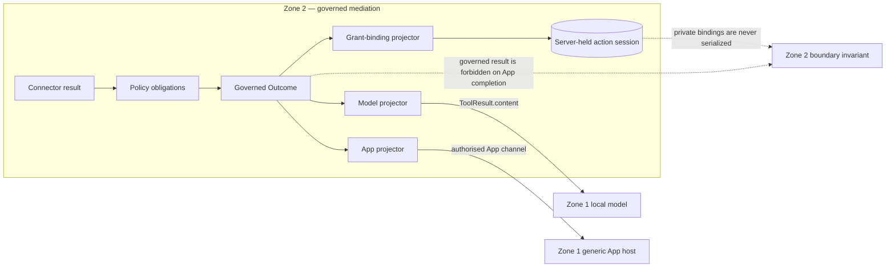

# ADR-0008: App completions carry audience projections, not governed results

## Status

Accepted.

## Context

ADR-0006 separated the model observation from the App presentation inside Zone
1, but the first implementation still sent the complete post-obligation
governed result beside `zone2_app` in MCP `structured_content`. Zone 1 discarded
that result before model history. This protected the model context, but it did
not prevent projection-private cursors, subject references and source references
from physically entering Zone 1.

List capabilities also need trusted per-row values to derive opaque App-action
grants. Treating those values as public row output made their non-disclosure
depend on every individual projector, despite their being routing state rather
than audience data.

## Decision

Zone 2 owns three distinct data classes after policy obligations:

| Type | Purpose | May cross into Zone 1? |
|---|---|---|
| Governed Outcome | Audited application result used inside Zone 2 | Only for the temporary non-App semantic path |
| Model Observation | Compact text deliberately projected for the local model | Yes, only through its declared audience channel |
| App Presentation | Post-obligation Prefab tree deliberately projected for the authorised human | Yes, only through its declared audience channel |
| Projection-Private Data | Top-level or per-row routing state used to build presentations and grants | No |

An initial successful App-enabled capability call uses a closed,
projection-only MCP result. The exact channels, keys, bounds, and forbidden
siblings are defined solely by the
[normative boundary contract](../data-boundary-and-projection-contract.md).
Zone 1 rejects any addition to that closed shape instead of ignoring it.

Projection-private values have separate typed declarations for top-level values
and list-row values. They are validated as part of the maximum Zone 2 result
contract, but are excluded from MCP discovery, model descriptions, the App tree,
the initial App completion envelope, action input, logs and audit display data.
They may be copied only into a server-held, digest-backed App-action grant.

The non-App semantic compatibility path retains a distinct bounded completion
contract temporarily. It must never be selected for an App-enabled result.
App-action calls continue to use the separate host-only surface and its closed
outcome contract as defined by ADR-0007 and the normative boundary contract.

## Consequences

- Zone 1 cannot accidentally checkpoint, log or forward rich governed data that
  it never receives.
- Zone 2 projectors keep access to the governed outcome without teaching the
  generic MCP adapter or Zone 1 about domain fields.
- Connector output remains exhaustively typed: private routing data is explicit,
  not an unvalidated side channel.
- The semantic App wire is smaller and intentionally differs from the non-App
  compatibility envelope.
- Zone 1 and Zone 2 must be released in order: Zone 2 producer first, then the
  strict Zone 1 consumer. Rollback is to a jointly compatible safe release;
  restoring raw governed JSON to App completions is prohibited.

This ADR amends ADR-0006 by strengthening “discard in Zone 1” to “do not send to
Zone 1”. It supersedes the governed-envelope-plus-`zone2_app` placement decision
in Zone 2 ADR-0025. ADR-0007 remains unchanged.
