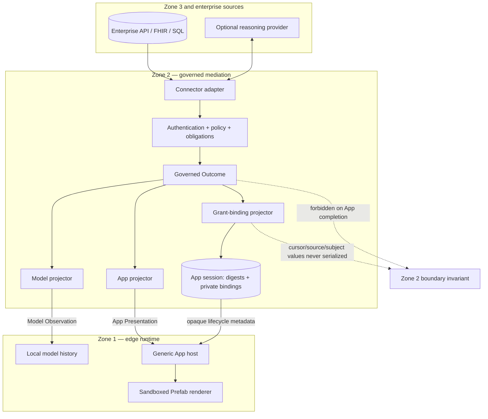
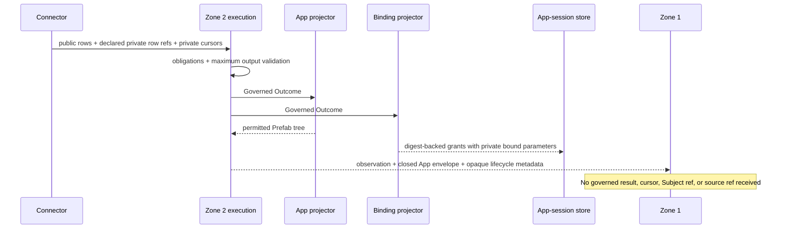

# Data boundary and projection contract

This is the normative, implementation-aligned guide to how information moves
between the zones. Cross-zone ADRs remain the decision record; this document is
the practical contract developers should read before changing a capability,
projector, MCP adapter, model loop, or App host.

## One governed result, separate audiences

Zone 2 is the only layer that talks to enterprise sources and decides what may
be disclosed. A completed request produces an internal **Governed Outcome**.
That object is not automatically a cross-zone response. For an App-enabled
capability, Zone 2 deliberately creates two independent audience projections:

| Type | Owner | Intended consumer | Transport |
|---|---|---|---|
| Governed Outcome | Zone 2 request/application layer | Zone 2 projectors and audit flow | Does not cross for App-enabled calls |
| Projection-Private Field | Zone 2 capability contract | Zone 2 presentation/grant derivation | Does not cross |
| Model Observation | Zone 2 model projector | Zone 1 local model | One FastMCP `content` text block |
| App Presentation | Zone 2 App projector | Authorised human through Zone 1 host | `structured_content.zone2_app` |
| App lifecycle metadata | Zone 2 App-session layer | Zone 1 private `AppInstance` | Restricted MCP `_meta` keys |

The model projection cannot be reconstructed from the App tree, and the App
tree cannot be reconstructed from model text. Zone 1 transports and isolates
these values; it does not decide which domain fields are safe.



Zone 3 is not enabled by the NHS or Northstar proof profiles. If enabled for a
future capability, it is a connector path behind Zone 2 policy. Neither Zone 1
history nor App browsing content may be forwarded to it implicitly. The
capability must declare and enforce its own Zone 3 projection contract.

## Exact initial App completion

An App-enabled semantic capability is invoked through the model-facing `/mcp`
surface. Its successful `ToolResult` has three channels:

```json
{
  "content": [
    { "type": "text", "text": "<compact Model Observation>" }
  ],
  "structured_content": {
    "status": "completed",
    "request_id": "<correlation only>",
    "zone2_app": { "$prefab": { "version": "..." }, "view": {} }
  },
  "_meta": {
    "zone2/app_session_id": "<opaque>",
    "zone2/app_action_handles": ["<opaque>"],
    "zone2/presentation_revision": 0
  }
}
```

The rules are intentionally rigid:

- `content` is exactly one non-empty text block, at most 1,024 Unicode code
  points. It is the only tool-derived value admitted to model history.
- `structured_content` has exactly three keys: `status`, `request_id`, and
  `zone2_app`.
- `result`, `provenance`, cursor, subject reference, source reference, action
  target, connector response, and raw document data are forbidden siblings.
- `_meta` is read only by the trusted Zone 1 gateway. The Zone 2 session
  reference and complete handle manifest never reach the desktop.
- A handle embedded in a visible control reaches the sandbox, but has no
  authority without the private session/instance/revision binding in the host.

Zone 1 rejects an envelope with extra keys. If the App envelope is valid but
the observation is invalid, it renders the App, skips the second inference, and
uses the fixed acknowledgement. It never falls back to structured JSON.

### Typed ownership at each edge

The repositories do not share Python packages. Each owns a type on its side of
the transport and an explicit mapper keeps them aligned:

| Boundary stage | Owning type | Responsibility |
|---|---|---|
| Zone 2 emission | `McpProjectedAppResult` | Strict-out three-key structured envelope |
| Zone 1 ingress | `Zone2ProjectedAppResult` | Strict-in mirror with unknown fields forbidden |
| Zone 1 application | `ProjectedAppCompletedOutcome` / `AppOnlyCompletedOutcome` | Separates model observation from response-scoped presentation |
| Zone 1 App hosting | `AppPresentation` then private `AppInstance` | Holds permitted tree separately from lifecycle binding |

This deliberate duplication is the anti-corruption seam: Zone 1 never imports
Zone 2 types, and Zone 2 never imports Zone 1 types. A configured real-endpoint
contract test—not a shared internal helper—proves the two mirrors agree.

## Public and projection-private capability fields

Zone 2 capability output has three typed scopes:

| Scope | Example | Published? | Allowed use |
|---|---|---|---|
| Public output | appointment reference, status, start | Yes, subject to policy and projector choice | Model or App projector |
| Projection-private top level | signed current/next cursor, view discriminator | No | App state and successor-grant derivation |
| Projection-private list row | upstream appointment/document reference, Subject routing reference | No | Per-row opaque-grant derivation |

All three scopes form the maximum connector-result contract and are validated
after obligations, before successful completion. Undeclared fields fail with
`OUTPUT_CONTRACT_VIOLATION`. Public and private row names must be disjoint, and
private row fields are legal only on a list result. Private does not mean
untyped or “hidden in the UI”; it means server-only and absent from transport.

For an authorised Zone 1 request, role-based public-field limiting preserves
the declared Projection-Private fields inside the Zone 2 pipeline so trusted
projectors can still issue grants. Zone 3 field limiting never preserves those
private values: a cloud-reasoning connector receives only its explicitly
declared public allowlist.

For a governed list, the typical internal flow is:



## App actions are not model tools

App navigation uses a separate `/mcp/app-actions` mount containing only
`apps.execute_action`. The local model neither discovers nor selects it.

The sandbox asks the host for:

```json
{
  "action_handle": "<opaque handle from a visible control>",
  "input": {}
}
```

The host adds its private App-session reference, instance binding, revision,
credentials, and action correlation. Zone 2 resolves the server-held grant,
re-authenticates, re-authorises, executes a normal governed request, and rotates
the session on success. The response has empty `content` and exactly one closed
replace/reject/fail structured outcome. Paging, filtering and drill-down create
no model call, conversation turn, or LangGraph checkpoint entry.

## Non-App compatibility and confirmation

A non-App semantic capability temporarily returns the bounded governed envelope
`{status, request_id, result, provenance}` for model consumption. This branch is
not a fallback for App-enabled calls and retains the existing 8,000-character
Zone 1 defensive cap.

Confirmation is a separate execution concern. A mutating capability enters the
Zone 2 governed confirmation state machine and uses native MCP elicitation. The
desktop only relays the human decision. Approval does not come from a Prefab
button, App action, model text, or Zone 1 policy.

## Change checklist

Before merging a change to this boundary, prove all of the following:

- The connector result declares every public and Projection-Private field.
- App projectors copy only explicit permitted display fields.
- Model projectors emit one bounded observation and no private/rich canary.
- Initial App `structured_content` contains exactly the three permitted keys.
- Source references, cursors, Subject references and raw governed results are
  absent from the entire MCP response received by Zone 1.
- Zone 1 rejects rather than ignores additional App-envelope fields.
- App actions remain absent from model discovery and take only opaque handles.
- App navigation changes neither model-call count nor transcript/checkpoint
  state.
- Zone 1 imports no Zone 2/Zone 3 source and contains no profile branch.
- Current contract docs and historical ADR amendment notes are updated in the
  same change.

## Authority and history

- [ADR-0002](adr/0002-mcp-as-zone-boundary-transport.md) — MCP is the zone boundary.
- [ADR-0003](adr/0003-mcp-tool-result-is-the-typed-zone-boundary-contract.md) — typed `ToolResult` contract.
- [ADR-0006](adr/0006-model-observation-and-app-presentation-are-independent-projections.md) — independent projections.
- [ADR-0007](adr/0007-host-only-governed-app-actions.md) — host-only action surface.
- [ADR-0008](adr/0008-app-completions-carry-audience-projections-not-governed-results.md) — governed results do not cross on App completions.
- [Connector design contract](../contracts/connector-design.md) — authoring and regression rules.

Historical phase plans and superseded ADRs explain how the design evolved; they
must not be used as the current wire contract when they conflict with this page
or ADR-0008.
