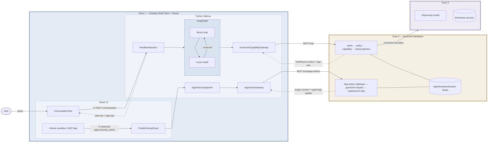
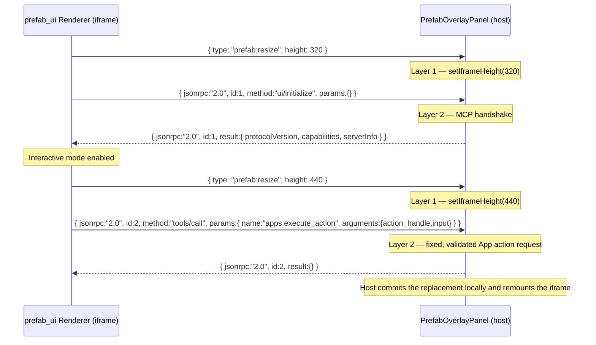
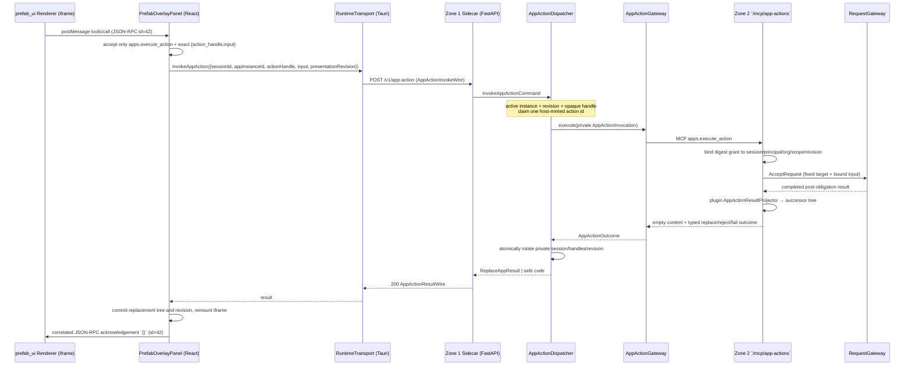
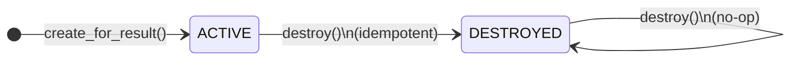
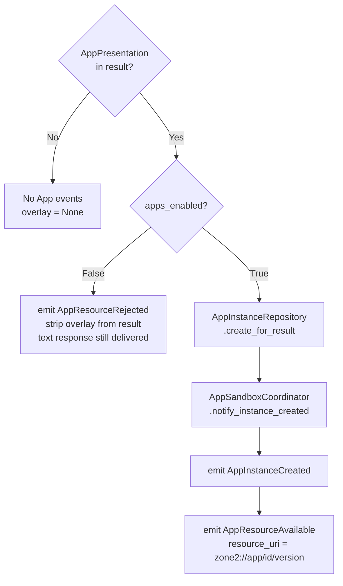

# FastMCP Apps and Prefab Overlay — Architecture Reference

This document explains how FastMCP Apps, Prefab overlays, and the sandboxed iframe bridge work across all three zones. It is written for developers who are new to this system and need to understand the full picture before touching any of these layers.

Cross-references:
- [ADR-0028](../../SovereignAgenticArchitectureZoneOne/docs/adr/0028-prefab-renderer-sandboxed-iframe-over-native-react-components.md) — sandboxed iframe decision record
- [confirmation-and-overlay-integration.md](../../SovereignAgenticArchitectureZoneOne/docs/dev/confirmation-and-overlay-integration.md) — cross-zone integration contract

---

## Contents

1. [What problem this solves](#1-what-problem-this-solves)
2. [Three-zone call map](#2-three-zone-call-map)
3. [FastMCP Apps — Zone 2 overlay builder](#3-fastmcp-apps--zone-2-overlay-builder)
4. [The governed result envelope](#4-the-governed-result-envelope)
5. [Zone 1 rendering pipeline](#5-zone-1-rendering-pipeline)
6. [The sandboxed iframe](#6-the-sandboxed-iframe)
7. [Two-layer postMessage protocol](#7-two-layer-postmessage-protocol)
8. [The host-only App-action bridge](#8-the-host-only-app-action-bridge)
9. [App instance lifecycle](#9-app-instance-lifecycle)
10. [Private App-session lifecycle](#10-private-app-session-lifecycle)
11. [Sidecar endpoints](#11-sidecar-endpoints)
12. [Tauri commands](#12-tauri-commands)
13. [`RuntimeTransport` — the abstraction boundary](#13-runtimetransport--the-abstraction-boundary)
14. [Adding a new capability with an overlay](#14-adding-a-new-capability-with-an-overlay)
15. [When to escalate beyond sandboxed iframe](#15-when-to-escalate-beyond-sandboxed-iframe)
16. [TUI fallback](#16-tui-fallback)
17. [Version pinning](#17-version-pinning)
18. [File index](#file-index)

---

## 1. What problem this solves

Zone 2 capabilities return governed data (records, search results, paginated lists). A plain text response works for the model, but a human user benefits from a structured visual. Zone 1's desktop must render these views **without knowing what they contain**.

The constraint is strict: Zone 1 must not import Zone 2 source code, reproduce Zone 2 domain vocabulary, or contain any capability-specific rendering logic. A new Zone 2 capability with a completely different visual layout must require **zero Zone 1 code changes**.

The solution is two layered systems:

- **FastMCP Apps** (Zone 2): a governed overlay builder that packages governed data into a generic `PrefabApp` tree
- **Prefab renderer** (Zone 1 desktop): a sandboxed iframe running the `prefab_ui` bundle that renders any `PrefabApp` tree with zero Zone 1 knowledge of its contents

---

## 2. Three-zone call map

There are two deliberately separate paths through the system:

- **Path ① — semantic capability:** the user sends a query; LangGraph lets the
  local model select a semantic capability from Zone 2's `/mcp` mount. A
  completed App result becomes two independent projections: compact model
  observation and an opaque Prefab App tree.
- **Path ② — human App action:** a control inside the sandboxed Prefab App asks
  the host to call the one fixed `apps.execute_action` tool on Zone 2's
  `/mcp/app-actions` mount. It is not a model tool and never becomes a
  conversation turn.



Zone 1 never imports Zone 2. The two typed Zone 1 gateways are its only Zone 2
exit points: `GovernedCapabilityGateway` for model-selected semantic
capabilities and `AppActionGateway` for host-mediated actions. Solid arrows
are calls; dashed arrows are responses.

---

## 3. FastMCP Apps — Zone 2 overlay builder

### 3a. The builder pattern

Every capability that should display a visual overlay configures an `McpAppDefinition` using the `AppOverlay` fluent builder:

```python
# src/zone2/apps/builder.py
definition = (
    AppOverlay("domain.list")
    .model_text("Found {count} items")              # compact model-facing summary
    .app(ItemListFactory(columns=COLUMNS, ...))      # visual factory for the iframe
    .compile()                                       # returns McpAppDefinition
)
```

`McpAppDefinition` (frozen dataclass, `apps/contracts.py`):
```python
@dataclass(frozen=True)
class McpAppDefinition:
    capability_id: str
    model_projector: ModelResultProjector    # str for the model's context window
    app_projector: AppResultProjector        # PrefabApp tree for the iframe
```

The model projector and app projector see the same `GovernedOutcome` but produce different outputs. The model gets a compact human-readable summary; the iframe gets a full structured Prefab tree.

### 3b. View factories

Three generic factories cover the common visual patterns:

| Factory | Use case | Key parameters |
|---|---|---|
| `ItemListFactory` | Static/simple lists | `columns`, `app_title`, `items_key` |
| `PaginatedListFactory` | Governed page replacement | `columns`, logical next/previous keys, optional `RowAction` |
| `RecordDetailFactory` | Single record detail | `fields`, `app_title`, `status_key` |
| `BookingConfirmationFactory` | Booking confirmation | `fields`, `app_title`, `status_key` |

All four live in `src/zone2/apps/factories/`. They implement `ViewFactory`:
```python
class ViewFactory(Protocol):
    def build(self, data: Mapping[str, Any]) -> PrefabApp: ...
```

`PrefabApp` is a `prefab_ui` Python type — a structured tree of generic node types (columns, tables, labels, buttons) that the renderer knows how to draw. Zone 1 never sees these types.

### 3c. Separate action wiring

A plugin registers an `McpAppDefinition` for the semantic entry capability and,
where the App is interactive, one or more separate `AppActionDefinition`
declarations. An action definition has a logical action key, a fixed governed
target, declared input schema, and a plugin-owned result projector. It is not a
`CapabilityDefinition`, is not added to the model catalogue, and is never
serialized as a backend capability ID in the App tree.

The generic `PaginatedListFactory` writes a logical action marker into a
Prefab `CallTool("apps.execute_action", ...)`. After the initial governed
result has passed obligations, Zone 2 replaces that marker with an ephemeral
opaque handle. The private action catalogue retains only a digest. New App
controls therefore require Zone 2 declaration and tests, but no Zone 1 domain
branch.

### 3d. The app session

When a user views an overlay with paginated data, subsequent page requests must reach the same Zone 2 context. Zone 2 creates an `AppInteractionSession` (frozen dataclass):

```python
session_id: str                      # UUID4 — private to the Zone 1 App host
principal_id: str                    # identity provider sub
org_id: str
entry_capability_id: str             # the capability that produced the initial overlay
query_fingerprint: str               # stable hash of principal+cap+params
subject_scope_fingerprint: str        # stable hash of authorised subject scope
presentation_revision: int           # prevents stale App replacement
action_grants: tuple[AppActionGrant] # digest-only, session-bound grants
created_at: datetime
expires_at: datetime
```

Zone 2 writes the session reference and a successor handle manifest into MCP
metadata for the trusted Zone 1 gateway. The gateway stores them only in its
private `AppInstance` lifecycle. They never travel inside the governed
`structured_content` envelope, model state, or desktop App wire.

---

## 4. The governed result envelope

When Zone 2 processes a capability with an app overlay, the MCP `ToolResult` has three relevant channels.

**`content`** — the compact Model Observation:

```text
Appointment list retrieved. 3 appointment(s) found.
```

Zone 1 accepts exactly one non-empty text block, with a maximum of 1,024
Unicode code points. This is the only tool-derived content that may enter the
local model's conversation history. It is not JSON-parsed and Zone 1 never
reconstructs it from governed fields.

**`structured_content`** — the governed data envelope (Zone 1 parses this):
```json
{
  "status": "completed",
  "request_id": "...",
  "result": { "items": [ ... ] },
  "provenance": { "reasoning_used": "...", "source_count": 0 },
  "zone2_app": {
    "$prefab": { "version": "0.3" },
    "view": { "type": "Div", "children": [ ... ] }
  }
}
```

**`_meta`** — MCP metadata (separate from the governed envelope):
```json
{ "zone2/app_session_id": "<uuid4>" }
```

For App-enabled results, Zone 1 maps the channels into independent values:

```text
ToolResult.content                         → Model Observation → LangGraph tool turn
structured_content.zone2_app + _meta       → App Presentation  → sandboxed renderer
structured_content.result                  → discarded at the Zone 1 MCP seam
```

The App Presentation is response-scoped rather than conversation state: it is
not placed in model history or LangGraph checkpoints. If the App is valid but
its Model Observation is missing, malformed, or too large, the App still
renders and Zone 1 stops model continuation with a fixed safe acknowledgement.
An invalid App envelope fails closed; Zone 1 never substitutes raw structured
JSON for either audience. The initial desktop result contains only the local
App instance ID, presentation revision and App tree; the Zone 2 session
reference and handle manifest remain private host lifecycle state. See
[ADR-0006](adr/0006-model-observation-and-app-presentation-are-independent-projections.md).

---

## 5. Zone 1 rendering pipeline

### 5a. Model-driven path (initial capability call)

```mermaid
sequenceDiagram
    participant User
    participant Desktop as Zone 1 Desktop (React)
    participant Sidecar as Zone 1 Sidecar (FastAPI)
    participant LangGraph as LangGraph Orchestrator
    participant Model as Local Model
    participant Gateway as GovernedCapabilityGateway
    participant Z2 as Zone 2 (FastMCP)

    User->>Desktop: submit query
    Desktop->>Sidecar: POST /v1/interaction
    Sidecar-->>Desktop: 202 + interaction_id
    Desktop->>Sidecar: GET /v1/interaction/{id}/result (polls)

    Sidecar->>LangGraph: HandleInteraction.execute()
    LangGraph->>Model: prompt + tool descriptions
    Model-->>LangGraph: tools/call → capability
    LangGraph->>Gateway: invoke(CapabilityInvocationRequest)
    Gateway->>Z2: MCP tools/call
    Z2-->>Gateway: ToolResult (content + structured_content + _meta)
    Gateway-->>LangGraph: typed Model Observation; App Presentation captured separately
    LangGraph->>Model: tool result (model projector text only)
    Model-->>LangGraph: final answer text
    LangGraph-->>Sidecar: DirectResponseResult (response_text + app_overlay + app_instance_id + presentation_revision)
    Sidecar-->>Desktop: DirectResponseResultWire
    Desktop->>Desktop: PrefabOverlayPanel renders iframe
```

### 5b. `prefab:initial-data` injection

The renderer HTML is fetched once from the sidecar (`GET /v1/prefab-renderer` → Tauri `get_prefab_renderer`). Before setting `srcDoc`, Zone 1 injects the overlay JSON into the HTML:

```
renderer HTML                     Modified HTML (srcDoc)
─────────────────────────         ───────────────────────────────────────────
<html>                            <html>
  <head>                            <head>
    ...                               ...
  </head>              ───►          <script id="prefab:initial-data"
  <body>                                     type="application/json">
    ...                               {"$prefab":{"version":"0.3"},...}
  </body>                             </script>
</html>                             </head>
                                    <body>
                                      ...
                                    </body>
                                  </html>
```

The renderer's internal `dsr()` function reads this element at module load. The initial view appears without any postMessage handshake. HTML-sensitive characters (`&`, `<`, `>`) are escaped to Unicode escapes to prevent injection via overlay content.

---

## 6. The sandboxed iframe

The deployed renderer uses
`sandbox="allow-scripts allow-same-origin"`. `allow-same-origin` is required
for the bundled renderer's module scripts on WebKit. It means the iframe is
**not** an opaque-origin security boundary, and the host must not claim that
the sandbox alone blocks same-origin browser facilities or network access.

The current security boundary is deliberately explicit and host-mediated:

- The iframe is not granted a Tauri capability. `invoke_app_action` exists only
  in the main-window Tauri configuration.
- The `PrefabOverlayPanel` accepts a message only from its current iframe,
  requires an exact JSON-RPC envelope, and accepts exactly
  `apps.execute_action({action_handle,input})` with no additional fields.
- The initial data contains no Zone 2 App-session reference, presentation
  revision, App-instance ID, complete handle manifest, capability target or
  host secret. The host contributes those private values after validation.
- The renderer cannot directly call the loopback sidecar because the
  per-sidecar `X-Host-Secret` is held by the desktop host, not injected into
  the App tree.

This is a bounded renderer, not a general-purpose third-party web surface. A
future richer document profile must add CSP/network/asset hardening and keep
this actual sandbox posture documented; it must not rely on an obsolete
opaque-origin assertion.

---

## 7. Two-layer postMessage protocol

The renderer and parent window use two coexisting message formats over the same `postMessage` channel. The host discriminates by checking `data["jsonrpc"] === "2.0"` first — if present it's Layer 2; otherwise it's a Layer 1 type check.

| Layer | Format | Direction | Purpose |
|---|---|---|---|
| 1 | `{ type: "prefab:resize", height: <n> }` | renderer → host | Dynamic height adjustment |
| 2 | JSON-RPC 2.0 (`jsonrpc`, `id`, `method`) | bidirectional | MCP interactive protocol |



**`id` correlation is mandatory.** The renderer tracks in-flight requests by auto-incrementing integer `id`. Responses must echo the exact same `id`. Without `ui/initialize` completing, the renderer stays in standalone (read-only) mode and widget buttons fail silently.

---

## 8. The host-only App-action bridge

A widget press (pagination, drill-down or a row action) is **not a
conversational turn**. It bypasses the model and LangGraph entirely, but it
does re-enter Zone 2's normal governed request path.



### Key invariants

**1. Fixed protocol, not arbitrary capability selection.** The host accepts only
`apps.execute_action`, with exactly an opaque `action_handle` and JSON-object
`input`. The iframe cannot provide a capability ID, app session reference,
cursor, source handle, or action ID.

**2. Local active-instance gate and atomicity.** `AppActionDispatcher` checks
that Apps are enabled, the conversation is open, the instance is active, the
instance ID belongs to that conversation, the supplied revision is current, and
the handle is known for that instance. It claims a single in-flight host action
before contacting Zone 2. A late result cannot replace a newer mounted App.

**3. Governed re-entry.** A valid grant resolves to a fixed target only inside
Zone 2. It re-enters `RequestGateway` as a normal governed request, retaining
authentication, policy, obligations, confirmation, audit and connector
handling. The App-action catalogue is delivery/presentation state, not a
second policy engine.

**4. No conversation history mutation.** The dispatcher does not invoke the
model, LangGraph or interaction runner, and never appends conversation turns.
The local model's capability catalogue and prompt remain unchanged by a page or
row action.

**5. Closed, App-only result channel.** Successful actions have empty FastMCP
`content` and a typed whole-tree replacement. Rejections and failures expose
only stable codes. The raw governed result is consumed by Zone 2's
plugin-owned `AppActionResultProjector`; it never enters the App-action MCP
wire, model history or `response_text`.

An App-specific renderer confirmation outcome is not part of PP-2's public
desktop wire. If a governed action requires confirmation, the trusted native
MCP confirmation coordinator is used; an unavailable or declined confirmation
returns a safe closed outcome rather than exposing a request or result to the
iframe.

---

## 9. App instance lifecycle

When the orchestrator returns an `AppPresentation`, Zone 1 tracks a single
active `AppInstance` per conversation session. This gives Zone 1 a local record
of the mounted overlay so it can enforce a fail-closed gate without relying
solely on Zone 2. The opaque presentation itself is response-scoped. The
private lifecycle stores only the Zone 2 App-session reference, current
revision, current raw handle manifest and in-flight host action ID.

### 9a. `AppInstance` state machine



- **ACTIVE** — overlay is mounted; `AppActionDispatcher` may evaluate a fixed
  App action.
- **DESTROYED** — session closed or instance torn down; all further App actions
  for that session are rejected.

### 9b. Instance creation (`HandleInteraction`)



`apps_enabled` is a plain `bool` injected at construction time — not a `RuntimeConfiguration` object. Operators can disable the entire App overlay feature without touching Zone 2.

### 9c. Host-only action gate (`AppActionDispatcher`)

The dispatcher runs all local checks before Zone 2 is contacted:

| Level | Check | Rejects with |
|---|---|---|
| 1 | Apps disabled, missing/closed conversation | Stable edge error; no MCP call |
| 2 | No `ACTIVE` instance or foreign `app_instance_id` | `APP_INSTANCE_NOT_FOUND` |
| 3 | Stale revision, unknown handle, or concurrent in-flight action | `APP_ACTION_NOT_ALLOWED` |

The host itself supplies the private Zone 2 App-session reference and a fresh
action/correlation ID after these checks. The renderer cannot present a token
from a previous App. Zone 2 remains the authoritative enforcement boundary: it
rebinds the handle digest to session, identity, organisation, query/scope and
revision before the governed request is submitted.

### 9d. Session close teardown

`LocalEdgeRuntime.close_session` checks for an active `AppInstance` before emitting `SessionClosed`. If one exists:

1. `instance.destroy()` — transitions to `DESTROYED`
2. `AppInstanceRepository.destroy_for_session(session_id)` — removes the record
3. `AppSandboxCoordinator.notify_instance_destroyed(app_instance_id)` — signals the render surface (no-op now; a future native mobile adapter replaces this with real mount/unmount signals)
4. Emit `AppInstanceDestroyed` on the SSE stream — the consumer always receives a terminal lifecycle event before `SessionClosed`

### 9e. `AppSandboxCoordinator` — the render surface seam

`AppSandboxCoordinator` (`contracts/ports.py`) is a `Protocol` with two hooks:

```python
async def notify_instance_created(self, instance: AppInstance) -> None: ...
async def notify_instance_destroyed(self, app_instance_id: AppInstanceId) -> None: ...
```

`NoOpAppSandboxCoordinator` is the current implementation. A future native mobile adapter will replace it with real platform-channel signals for mounting and unmounting the sandboxed surface.

---

## 10. Private App-session lifecycle

```mermaid
sequenceDiagram
    participant Z2 as Zone 2
    participant GW as GovernedCapabilityGateway
    participant HI as HandleInteraction
    participant Desktop as Desktop (React)
    participant iframe as prefab_ui iframe
    participant AD as AppActionDispatcher
    participant AG as AppActionGateway

    Z2->>GW: ToolResult\ncontent = ModelObservation\n_meta = private session + handles\nstructured_content["zone2_app"] = {...}
    GW->>HI: ProjectedAppCompletedOutcome\nModelObservation + AppPresentation
    HI->>HI: AppInstanceRepository.create_for_result\nprivate session, revision and handles stored
    HI->>Desktop: DirectResponseResultWire\napp_instance_id + revision + app_overlay

    Desktop->>iframe: srcdoc injection\n(prefab:initial-data contains app_overlay)
    Note over iframe: Renders initial view\ncontains only opaque visible action handle(s)

    iframe->>Desktop: postMessage tools/call\napps.execute_action({action_handle,input})
    Note over Desktop: Host holds session, revision and full manifest\niframe never sees the session reference
    Desktop->>AD: InvokeAppActionCommand\nlocal instance + renderer request only
    AD->>AD: validate + claim known handle/revision\nmint action ID
    AD->>AG: private AppActionInvocation\nadds session + revision + action ID
    AG->>Z2: MCP apps.execute_action
    Z2->>Z2: validate grant/session/scope; governed request; rotate session
    Z2-->>AG: empty content + ReplaceApp\nprivate successor session + handles in metadata
    AG-->>AD: typed AppActionReplaceOutcome
    AD->>AD: atomically replace private lifecycle state
    AD-->>Desktop: ReplaceAppResult\napp_instance_id + successor revision + tree
    Desktop->>iframe: remount replacement tree\ncorrelated acknowledgement
```

---

## 11. Sidecar endpoints

| Endpoint | Method | Response | Purpose |
|---|---|---|---|
| `/v1/prefab-renderer` | GET | 200 HTML | Serve bundled `prefab_ui` renderer HTML |
| `/v1/interaction` | POST | 202 | Submit conversational query (model-driven path) |
| `/v1/interaction/{id}/result` | GET | 200 | Poll for a model-driven interaction result |
| `/v1/app-action` | POST | 200 | Host-only fixed App-action relay; returns a typed replacement or safe code |
| `/v1/interaction/{id}/events` | GET | SSE | Stream `InteractionAccepted`, `InteractionCompleted`, App lifecycle events |

All endpoints under `/v1/` require the `X-Host-Secret` header (ephemeral per-sidecar secret shared between Tauri shell and sidecar at startup).

---

## 12. Tauri commands

| Command | Rust function | Purpose |
|---|---|---|
| `get_prefab_renderer` | `commands::get_prefab_renderer` | Proxy `GET /v1/prefab-renderer`; result cached in Tauri process |
| `submit_interaction` | `commands::submit_interaction` | POST conversational query; mints `interaction_id` |
| `await_interaction` | `commands::await_interaction` | Poll `/v1/interaction/{id}/result` with backoff |
| `invoke_app_action` | `commands::invoke_app_action` | POST `/v1/app-action`; returns one typed App-action result |

These commands are **only listed in the main window's Tauri capability config**.
They are not accessible from the sandboxed iframe.

---

## 13. `RuntimeTransport` — the abstraction boundary

All desktop feature code reaches the Zone 1 sidecar through `getRuntimeTransport()`, never by importing from `@platform/tauri` or `@tauri-apps/api/core` directly. This is enforced by the dependency cruiser config.

```typescript
// src/modules/runtime-client/transport/runtime-transport.ts
interface RuntimeTransport {
  getPrefabRenderer(): Promise<string>;
  invokeAppAction(input: InvokeAppAction): Promise<AppActionResult>;
  // ... other methods
}

interface InvokeAppAction {
    sessionId: string;
    appInstanceId: string;
    actionHandle: string;
    input: AppActionInput;
    presentationRevision: number;
}
```

The production implementation (`TauriRuntimeTransport`) delegates to Tauri commands. Tests use `InMemoryRuntimeTransport` with per-operation `Responder` fakes — no Tauri, no sidecar.

---

## 14. Adding a new capability with an overlay

This is the process a Zone 2 developer follows to add a new governed capability that produces a visual overlay. **Zone 1 requires no changes.**

**Step 1 — Define the capability** in Zone 2 (`src/zone2/plugins/<domain>/capabilities.py`):
```python
MY_CAPABILITY = CapabilityDefinition(
    capability_id="domain.list",
    name="domain.list",
    ...
)
```

**Step 2 — Build an overlay definition** using the fluent builder:
```python
from zone2.apps.builder import AppOverlay
from zone2.apps.factories import PaginatedListFactory

MY_APP_DEFINITION = (
    AppOverlay(MY_CAPABILITY)
    .model_text("Found {count} items")
    .app(PaginatedListFactory(
        columns=MY_COLUMNS,
        app_title="My List",
        next_action_key="next-page",
        previous_action_key="previous-page",
    ))
    .compile()
)
```

**Step 3 — Declare the semantic capability and human actions separately** via
`ContainerModuleRegistry`:
```python
registry.register_capability(MY_CAPABILITY, app_overlay=MY_APP_DEFINITION)

registry.register_app_action(AppActionDefinition(
    action_key="next-page",
    entry_capability_id=MY_CAPABILITY.capability_id,
    target_capability_id=MY_NEXT_PAGE_CAPABILITY.capability_id,
    target_capability_version=MY_NEXT_PAGE_CAPABILITY.version,
    result_projector=MY_PAGE_RESULT_PROJECTOR,
))
```

`MY_PAGE_RESULT_PROJECTOR` is plugin-owned. It receives the completed,
post-obligation governed outcome and creates the next Prefab tree. It does not
produce model text or return a raw result mapping.

**Step 4 — keep target parameters server-side.** The target capability may be
semantic or administrative according to the plugin's normal governed policy,
but its ID, cursor/continuation data and bound parameters are held in the
session grant. The generic `PaginatedListFactory` only controls which logical
action marker is rendered. Zone 1's `PrefabOverlayPanel` will render and relay
the output without modification.

---

## 15. When to escalate beyond sandboxed iframe

The current `sandbox="allow-scripts"` approach is appropriate for governed Zone 2 content in bundled mode. Escalate to a secondary Tauri `WebviewWindow` when:

- A **third-party** (non-Zone-2) MCP server produces overlays
- The renderer needs network access beyond loopback (CDN resources, external assets)
- The HTML contains `<script src="https://...">` references (detectable: scan before setting `srcDoc`)
- The overlay requires OS-level permissions (camera, microphone, filesystem)

---

## 16. TUI fallback

The terminal UI (`zone1 tui`) cannot render HTML. The generic fallback dispatcher (`cli/tui/apps_placeholder.py::_render_prefab_node`) recurses only on the structural `Stack` type and renders all other node types as generic key-value Rich panels.

This is consistent with the zero-knowledge principle: the TUI knows only `Stack` from Prefab's structure. It has no knowledge of any capability-specific node types.

---

## 17. Version pinning

Both zones pin the **same `prefab-ui==0.20.2` version**. A mismatch would cause
the renderer to misinterpret the `zone2_app` JSON tree. This is enforced as a
build-time constraint in both `pyproject.toml` files. Both also currently lock
the FastMCP 4 beta line (`>=4.0.0b1,<5`); FastMCP's own Apps guidance recommends
pinning Prefab because its API evolves frequently.

`prefab_ui` is the single source of truth for:
- The `PrefabApp` Python types Zone 2 uses to build trees
- The renderer HTML bundle Zone 1 serves from `GET /v1/prefab-renderer`

---

## File index

| File | Zone | Purpose |
|---|---|---|
| `src/zone2/apps/builder.py` | 2 | `AppOverlay` fluent builder |
| `src/zone2/apps/contracts.py` | 2 | `McpAppDefinition`, `AppInteractionSession`, protocols |
| `src/zone2/apps/factories/` | 2 | Static, detail, confirmation and `PaginatedListFactory` Prefab factories |
| `src/zone2/api/mcp/tools.py` | 2 | `_build_capability_handler` — overlay finalization + session creation |
| `src/zone2/api/mcp/app_actions.py` | 2 | Separate `FastMCPApp` mount with `apps.execute_action` (`model=False`) |
| `src/zone2/contracts/app_actions.py` | 2 | App-action grants, session state and result-projector contracts |
| `src/zone2/contexts/app_interaction/` | 2 | Host-only action handler and declaration catalogue |
| `runtime/src/zone1/application/dispatch_app_action.py` | 1 | `AppActionDispatcher` — host-only gate, action claim and atomic replacement |
| `runtime/src/zone1/application/handle_interaction.py` | 1 | `HandleInteraction` — App instance creation + event emission |
| `runtime/src/zone1/contexts/app_hosting/domain/instance.py` | 1 | `AppInstance` state machine |
| `runtime/src/zone1/infrastructure/app_instances/in_memory.py` | 1 | `InMemoryAppInstanceRepository` |
| `runtime/src/zone1/api/http/routers.py` | 1 | `POST /v1/app-action` and renderer endpoints |
| `runtime/src/zone1/api/wire/commands.py` | 1 | `AppActionInvokeWire` and interaction command schemas |
| `runtime/src/zone1/contracts/app_actions.py` | 1 | Host-only action contracts and closed outcomes |
| `runtime/src/zone1/contracts/ports.py` | 1 | Gateway, App-instance and sandbox ports |
| `desktop/src-tauri/src/commands.rs` | 1 | `invoke_app_action` and renderer commands |
| `desktop/src/features/conversation/PrefabOverlayPanel.tsx` | 1 | Sandboxed iframe + two-layer postMessage bridge |
| `desktop/src/features/conversation/InteractionResultView.tsx` | 1 | Passes local App instance ID, revision and App tree to the panel |
| `desktop/src/modules/runtime-client/transport/runtime-transport.ts` | 1 | `RuntimeTransport` interface |
| `desktop/src/platform/tauri/tauri-runtime-transport.ts` | 1 | Production Tauri implementation |
| `desktop/src/shared/testing/in-memory-runtime-transport.ts` | 1 | Test fake |
| `docs/adr/0028-*.md` | 1 | Full sandboxed iframe decision record |
| `runtime/docs/adr/0029-*.md` | 1 | App instance lifecycle and local gate decision record |
