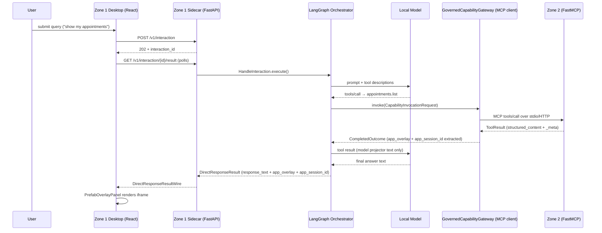
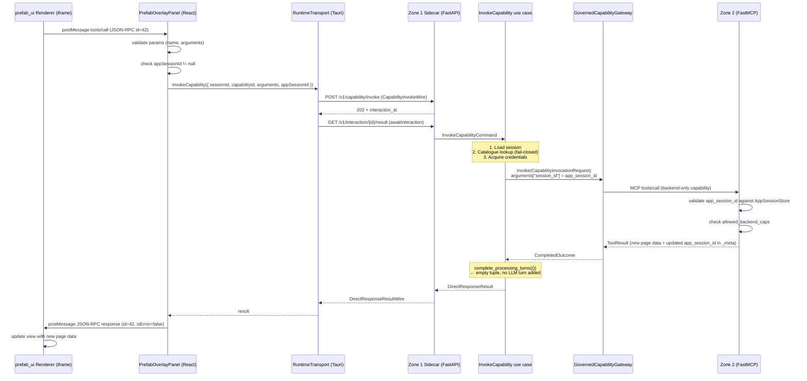

# FastMCP Apps and Prefab Overlay — Architecture Reference

This document explains how FastMCP Apps, Prefab overlays, and the sandboxed iframe bridge work across all three zones. It is written for developers who are new to this system and need to understand the full picture before touching any of these layers.

Cross-references:
- [ADR-0028](../../SovereignAgenticArchitectureZoneOne/docs/adr/0028-prefab-renderer-sandboxed-iframe-over-native-react-components.md) — sandboxed iframe decision record
- [confirmation-and-overlay-integration.md](../../SovereignAgenticArchitectureZoneOne/docs/dev/confirmation-and-overlay-integration.md) — cross-zone integration contract

---

## 1. What problem this solves

Zone 2 capabilities return governed data (appointments, records, search results). A plain text response works for the model, but a human user benefits from a structured visual — paginated lists, detail cards, booking confirmations. Zone 1's desktop must render these views **without knowing what they contain**.

The constraint is strict: Zone 1 must not import Zone 2 source code, reproduce Zone 2 domain vocabulary, or contain `case "AppointmentCard"` anywhere. A new Zone 2 capability with a completely different visual layout must require **zero Zone 1 code changes**.

The solution is two layered systems:

- **FastMCP Apps** (Zone 2): a governed overlay builder that packages governed data into a generic `PrefabApp` tree
- **Prefab renderer** (Zone 1 desktop): a sandboxed iframe running the `prefab_ui` bundle that renders any `PrefabApp` tree with zero Zone 1 knowledge of its contents

---

## 2. Three-zone call map

```
┌─────────────────────────────────────────────────────────────────────────────┐
│ Zone 1 — Edge Runtime (SovereignAgenticArchitectureZoneOne)                 │
│                                                                             │
│  Flutter/Tauri desktop shell                                                │
│  ┌──────────────────────────────────────────────────────┐                  │
│  │  PrefabOverlayPanel (React)                          │                  │
│  │  ┌──────────────────────────────────┐                │                  │
│  │  │  <iframe sandbox="allow-scripts">│ ◄──────────────┼── prefab_ui      │
│  │  │  Layer 1: prefab:resize          │                │   renderer HTML  │
│  │  │  Layer 2: JSON-RPC 2.0           │                │                  │
│  │  └──────────────────────────────────┘                │                  │
│  └──────────────────────────────────────────────────────┘                  │
│           │  postMessage (tools/call)                                       │
│           ▼                                                                 │
│  InvokeCapability use case ──► GovernedCapabilityGateway (MCP client)      │
│                                                                             │
│  OR (model-driven path):                                                    │
│  HandleInteraction ──► LangGraph orchestrator ──► Local model              │
│                                        │                                    │
│                                        ▼                                    │
└────────────────────────────────────── MCP ─────────────────────────────────┘
                                         │  (Zone 1 never imports Zone 2)
                                         ▼
┌─────────────────────────────────────────────────────────────────────────────┐
│ Zone 2 — Governed Mediation (SovereignAgenticArchitectureZoneTwo)           │
│                                                                             │
│  FastMCP server + policy engine                                             │
│  ┌───────────────────────────────────────────────────────────────────────┐  │
│  │ _build_capability_handler                                             │  │
│  │   authenticate caller → evaluate policy → run capability →            │  │
│  │   strip to permitted fields → build PrefabApp → wrap in ToolResult   │  │
│  └───────────────────────────────────────────────────────────────────────┘  │
│                                                                             │
│  App session store (Redis): AppInteractionSession per user+capability       │
└─────────────────────────────────────────────────────────────────────────────┘
                                         │  (Zone 2 connector boundary only)
                                         ▼
┌─────────────────────────────────────────────────────────────────────────────┐
│ Zone 3 — Reasoning Model + Enterprise Sources                               │
│  FHIR, SQL, third-party APIs — only reachable through Zone 2               │
└─────────────────────────────────────────────────────────────────────────────┘
```

---

## 3. FastMCP Apps — Zone 2 overlay builder

### 3a. The builder pattern

Every capability that should display a visual overlay configures an `McpAppDefinition` using the `AppOverlay` fluent builder:

```python
# src/zone2/apps/builder.py
definition = (
    AppOverlay("appointments.list")
    .model_text("Found {count} appointments")          # compact model-facing summary
    .app(ItemListFactory(columns=COLUMNS, ...))        # visual factory for the iframe
    .backend_caps("appointments.list_page")            # capabilities unlocked per session
    .compile()                                         # returns McpAppDefinition
)
```

`McpAppDefinition` (frozen dataclass, `apps/contracts.py`):
```python
@dataclass(frozen=True)
class McpAppDefinition:
    capability_id: str
    model_projector: ModelResultProjector    # str for the model's context window
    app_projector: AppResultProjector        # PrefabApp tree for the iframe
    backend_capability_ids: frozenset[str]   # allowed backend calls this session
```

The model projector and app projector see the same `GovernedOutcome` — but produce different outputs. The model gets a compact human-readable summary; the iframe gets a full structured Prefab tree.

### 3b. View factories

Three generic factories cover the common visual patterns:

| Factory | Use case | Key parameters |
|---|---|---|
| `ItemListFactory` | Paginated lists | `columns`, `app_title`, `items_key` |
| `RecordDetailFactory` | Single record detail | `fields`, `app_title`, `status_key` |
| `BookingConfirmationFactory` | Booking confirmation | `fields`, `app_title`, `status_key` |

All three live in `src/zone2/apps/factories/`. They implement `ViewFactory`:
```python
class ViewFactory(Protocol):
    def build(self, data: Mapping[str, Any]) -> PrefabApp: ...
```

`PrefabApp` is a `prefab_ui` Python type — a structured tree of generic node types (columns, tables, labels, buttons) that the renderer knows how to draw. Zone 1 never sees these types.

### 3c. NHS capability wiring (example)

The NHS plugin (`src/zone2/plugins/nhs/capabilities.py`) registers three app definitions at module load:

```python
NHS_APPOINTMENT_LIST_APP_DEFINITION   # capability_id="appointments.list",  backend_caps={"appointments.list_page"}
NHS_APPOINTMENT_DETAILS_APP_DEFINITION # capability_id="appointments.get_details"
NHS_APPOINTMENT_BOOKING_APP_DEFINITION  # capability_id="appointments.book"
```

These are singletons defined in `src/zone2/apps/nhs/projectors.py` and registered in `McpAppRegistry`. New capabilities simply add another definition — no Zone 1 change required.

### 3d. The app session

When a user views an overlay with paginated data, subsequent page requests must reach the same Zone 2 context. Zone 2 creates an `AppInteractionSession` (frozen dataclass):

```python
session_id: str                      # UUID4 — this is what Zone 1 calls "app_session_id"
principal_id: str                    # Keycloak sub
org_id: str
entry_capability_id: str             # e.g. "appointments.list"
allowed_backend_caps: frozenset[str] # e.g. {"appointments.list_page"}
query_fingerprint: str               # stable hash of principal+cap+params
created_at: datetime
expires_at: datetime
```

Zone 2 writes this session's `session_id` into the MCP tool result `_meta` under the key `"zone2/app_session_id"`. Zone 1's gateway extracts it from there. It never travels inside the governed `structured_content` envelope.

---

## 4. The governed result envelope

When Zone 2 processes a capability with an app overlay, the MCP `ToolResult` has two parts:

**`structured_content`** — the governed data envelope (Zone 1 parses this):
```json
{
  "status": "completed",
  "request_id": "...",
  "result": { "appointments": [ ... ] },
  "provenance": { "reasoning_used": "...", "source_count": 0 },
  "zone2_app": {
    "$prefab": { "version": "0.3" },
    "view": { "type": "Div", "children": [ ... ] }
  }
}
```

**`_meta`** — MCP metadata (separate from the governed envelope):
```json
{ "zone2/app_session_id": "<uuid4>" }
```

Zone 1's gateway (`GovernedCapabilityGateway`) extracts `zone2_app` and `zone2/app_session_id` from `CompletedOutcome.app_meta` before the result reaches the application layer. The desktop sees them as `DirectResponseResultWire.app_overlay` and `DirectResponseResultWire.app_session_id`.

---

## 5. Zone 1 rendering pipeline

### 5a. Model-driven path (initial capability call)



### 5b. `prefab:initial-data` injection

The renderer HTML is fetched once from the sidecar (`GET /v1/prefab-renderer` → Tauri `get_prefab_renderer`). Before setting `srcDoc`, Zone 1 injects the overlay JSON into the HTML:

```
renderer HTML                     Modified HTML (srcDoc)
─────────────────────────         ───────────────────────────────────────────
<html>                            <html>
  <head>                            <head>
    ...                               ...
  </head>              ───►          <script id="prefab:initial-data"
  <body>                                     type="application/json">
    ...                               {"$prefab":{"version":"0.3"},...}
  </body>                             </script>
</html>                             </head>
                                    <body>
                                      ...
                                    </body>
                                  </html>
```

The renderer's internal `dsr()` function reads this element at module load. The initial view appears without any postMessage handshake. HTML-sensitive characters (`&`, `<`, `>`) are escaped to Unicode escapes (`&`, `<`, `>`) to prevent injection via overlay content.

---

## 6. The sandboxed iframe

```
┌─────────────────────────────────────────────────────────┐
│  Tauri WebviewWindow (parent)                           │
│                                                         │
│  window.__TAURI__ ✓ accessible here                     │
│                                                         │
│  ┌───────────────────────────────────────────────────┐  │
│  │  <iframe                                          │  │
│  │    srcdoc={injected HTML}                         │  │
│  │    sandbox="allow-scripts"                        │  │
│  │    title="Result overlay"                         │  │
│  │  >                                                │  │
│  │                                                   │  │
│  │  Renderer runs here (opaque origin):              │  │
│  │  ✗ window.__TAURI__ — inaccessible               │  │
│  │  ✗ parent DOM — cross-origin blocked             │  │
│  │  ✗ localStorage / sessionStorage — blocked       │  │
│  │  ✗ Network requests — no allow-same-origin        │  │
│  │  ✓ window.parent.postMessage — only channel out  │  │
│  │  ✓ JavaScript execution (allow-scripts)          │  │
│  │                                                   │  │
│  └───────────────────────────────────────────────────┘  │
└─────────────────────────────────────────────────────────┘
```

`sandbox="allow-scripts"` without `allow-same-origin` gives the iframe an **opaque origin**. This is the critical security property: the renderer bundle cannot call Tauri commands, cannot read parent state, and cannot escalate privileges. Its only communication channel to Zone 1 is `postMessage`.

The `invoke_capability` Tauri command is **not listed** in the iframe's Tauri capability config — it is only accessible to the main window's JS. Even if a malicious payload in the renderer tried to call Tauri directly, it has no path to do so.

---

## 7. Two-layer postMessage protocol

The renderer and parent window use two coexisting message formats over the same `postMessage` channel:

| Layer | Format | Direction | Purpose |
|---|---|---|---|
| Layer 1 | `{ type: "prefab:resize", height: <n> }` | renderer → host | Dynamic height adjustment |
| Layer 2 | Full JSON-RPC 2.0 (`jsonrpc`, `id`, `method`) | bidirectional | MCP interactive protocol |

The host discriminates: **check `data["jsonrpc"] === "2.0"` first**. If present → Layer 2. Otherwise → Layer 1 `type` check. Both layers coexist; neither interferes with the other.

### Layer 1: `prefab:resize`

```typescript
// Renderer sends:
window.parent.postMessage({ type: "prefab:resize", height: 420 }, "*");

// Host handler (PrefabOverlayPanel.tsx):
if (type === "prefab:resize") {
  if (typeof h === "number" && h > 0) setIframeHeight(h);
}
```

### Layer 2: JSON-RPC 2.0

#### `ui/initialize` — MCP handshake

The renderer sends this on startup. Without a host response it stays in standalone (read-only) mode; interactive widget buttons fail silently.

```
Renderer → Host:
{
  "jsonrpc": "2.0",
  "id": 1,
  "method": "ui/initialize",
  "params": {}
}

Host → Renderer:
{
  "jsonrpc": "2.0",
  "id": 1,
  "result": {
    "protocolVersion": "2026-01-26",
    "capabilities": { "tools": {} },
    "serverInfo": { "name": "zone1-host", "version": "1.0" }
  }
}
```

#### `tools/call` — widget action

When the user activates a pagination button or drill-down link:

```
Renderer → Host:
{
  "jsonrpc": "2.0",
  "id": 42,
  "method": "tools/call",
  "params": {
    "name": "appointments.list_page",
    "arguments": { "page": 2, "page_size": 10 }
  }
}

Host → Renderer (success):
{
  "jsonrpc": "2.0",
  "id": 42,
  "result": {
    "content": [{ "type": "text", "text": "{...}" }],
    "isError": false
  }
}

Host → Renderer (failure):
{
  "jsonrpc": "2.0",
  "id": 42,
  "error": { "code": -32000, "message": "Capability invocation failed" }
}
```

**`id` correlation is mandatory.** The renderer tracks in-flight requests by auto-incrementing integer `id`. Responses must echo the exact same `id`. Correlating by capability name would break concurrent calls to the same capability.

---

## 8. The toolCall bridge — full call flow

A widget press (pagination, drill-down) is **not a conversational turn**. It bypasses the model and orchestrator entirely.



### Key invariants in the toolCall bridge

**1. Fail-closed capability check.** `InvokeCapability` looks up `capability_id` in the session's `CapabilityCatalogue` before touching the gateway. If the capability is not in the catalogue, the call is rejected and Zone 2 is never contacted. This prevents arbitrary tool invocations via the overlay.

**2. No conversation history mutation.** `session.complete_processing_turns(())` is called with an empty tuple. The LLM context window (`session.turns`) is unchanged. Page 2 of a list does not contaminate the conversation history.

**3. `app_session_id` threading.** Zone 2's backend handler reads the app session from `arguments["session_id"]` (literal key, module-level constant `_SESSION_ID_PARAM`). Zone 1's `InvokeCapability` merges the Zone 1 `app_session_id` field into `gateway_arguments["session_id"]`:
```python
gateway_arguments = dict(command.arguments) | {"session_id": command.app_session_id}
```
The iframe never sees `app_session_id` directly — it flows through the host only.

**4. Zone 1 `session_id` ≠ Zone 2 `session_id`.** Zone 1's `session_id` identifies the `InteractionSession` (conversation). Zone 2's `session_id` (what Zone 1 calls `app_session_id`) identifies the `AppInteractionSession` (the stateful overlay context). They are different concepts, different scopes, and must never be conflated.

---

## 9. App instance lifecycle

When the orchestrator returns a result that contains an `app_overlay`, Zone 1 tracks a single active `AppInstance` per conversation session. This gives Zone 1 a local record of the mounted overlay so it can enforce a fail-closed gate without relying solely on Zone 2.

### 9a. `AppInstance` state machine

`AppInstance` (`contexts/app_hosting/domain/instance.py`) is a plain dataclass:

```
ACTIVE  ──destroy()──►  DESTROYED
```

- **ACTIVE** — the overlay is mounted; `InvokeCapability` may proceed.
- **DESTROYED** — the session has closed or the instance was torn down; all further `InvokeCapability` calls for that session are rejected.

`destroy()` is idempotent: calling it on an already-`DESTROYED` instance is a no-op.

### 9b. Instance creation (`HandleInteraction`)

After the orchestrator returns:

```
result.app_overlay is not None
         │
         ├── apps_enabled=False ──► emit AppResourceRejected
         │                          strip overlay from DirectResponseResult
         │                          (text response still delivered)
         │
         └── apps_enabled=True  ──► AppInstanceRepository.create_for_result(...)
                                     AppSandboxCoordinator.notify_instance_created(instance)
                                     emit AppInstanceCreated
                                     emit AppResourceAvailable
                                       resource_uri = zone2://app/<capability_id>/<app_version>
```

`apps_enabled` is a plain `bool` injected at construction time — not a `RuntimeConfiguration` object. Operators can disable the entire App overlay feature without touching Zone 2.

### 9c. Three-level local gate (`InvokeCapability`)

Before the catalogue lookup, `InvokeCapability` runs three fail-closed checks:

| Level | Check | Error code |
|---|---|---|
| 1 | `apps_enabled=False` | `APP_RESOURCE_REJECTED` |
| 2 | No `ACTIVE` `AppInstance` for the session (includes replayed destroyed-session tokens) | `APP_INSTANCE_NOT_FOUND` |
| 3 | `command.app_session_id ≠ instance.app_session_id` (confused-deputy defence) | `APP_SESSION_EXPIRED` |

All three checks run **before** Zone 2 is contacted. Zone 2's `_validate_session` remains the authoritative enforcement boundary; the Zone 1 gate is defence-in-depth that avoids an unnecessary round-trip on known-invalid calls.

### 9d. Session close teardown

`LocalEdgeRuntime.close_session` checks for an active `AppInstance` before emitting `SessionClosed`. If one exists:

1. `instance.destroy()` — transitions the in-memory object to `DESTROYED`
2. `AppInstanceRepository.destroy_for_session(session_id)` — removes the record
3. `AppSandboxCoordinator.notify_instance_destroyed(app_instance_id)` — signals the render surface (no-op in Phase 6; Phase 8 sends a Flutter channel signal)
4. Emit `AppInstanceDestroyed` on the SSE stream — the consumer always receives a terminal lifecycle event before `SessionClosed`

### 9e. `AppSandboxCoordinator` — the render surface seam

`AppSandboxCoordinator` (`contracts/ports.py`) is a `Protocol` with two hooks:

```python
async def notify_instance_created(self, instance: AppInstance) -> None: ...
async def notify_instance_destroyed(self, app_instance_id: AppInstanceId) -> None: ...
```

Phase 6 injects `NoOpAppSandboxCoordinator`. Phase 8 (Flutter MCP App sandbox) replaces it with an adapter that sends native channel signals to mount/unmount the WebView.

---

## 10. `app_session_id` — full lifecycle

```
Zone 2 creates session                       Zone 1 receives session
──────────────────────                       ──────────────────────
AppInteractionSession {                      DirectResponseResultWire {
  session_id: "abc-123"   ──────────────►      app_session_id: "abc-123"
  allowed_backend_caps:                         app_overlay: { "$prefab": ... }
    {"appointments.list_page"}               }
}
↓
ToolResult._meta["zone2/app_session_id"] = "abc-123"
ToolResult.structured_content["zone2_app"] = { "$prefab": ... }

                          ──────────────►   PrefabOverlayPanel receives:
                                              appSessionId: "abc-123" (prop)
                                              appOverlay: { "$prefab": ... } (prop)

                          Widget press:     handleToolCall("appointments.list_page", {page:2})
                                              invokeCapability({
                                                capabilityId: "appointments.list_page",
                                                appSessionId: "abc-123"   ← forwarded
                                              })

                          ──────────────►   InvokeCapabilityCommand {
                                              capability_id: "appointments.list_page"
                                              app_session_id: "abc-123"
                                            }
                                              gateway_arguments = { page: 2, session_id: "abc-123" }
                                                                               ↑
                                            Zone 2 reads this as _SESSION_ID_PARAM
```

---

## 11. Sidecar endpoints involved

| Endpoint | Method | Status | Phase | Purpose |
|---|---|---|---|---|
| `/v1/prefab-renderer` | GET | 200 HTML | Phase 4 | Serve bundled `prefab_ui` renderer HTML |
| `/v1/interaction` | POST | 202 | Phase 1 | Submit conversational query (model-driven) |
| `/v1/interaction/{id}/result` | GET | 200 | Phase 1 | Poll for interaction result (shared by both paths) |
| `/v1/capability/invoke` | POST | 202 | Phase 5 | Direct capability invocation (overlay toolCall bridge) |
| `/v1/interaction/{id}/events` | GET | SSE | Phase 2 | Stream `InteractionAccepted`, `InteractionCompleted` events |

All endpoints under `/v1/` require the `X-Host-Secret` header (ephemeral per-sidecar secret shared between Tauri shell and sidecar at startup).

---

## 12. Tauri commands involved

| Command | Rust function | Purpose |
|---|---|---|
| `get_prefab_renderer` | `commands::get_prefab_renderer` | Proxy `GET /v1/prefab-renderer`; result cached in Tauri process |
| `submit_interaction` | `commands::submit_interaction` | POST conversational query; mints `interaction_id` |
| `await_interaction` | `commands::await_interaction` | Poll `/v1/interaction/{id}/result` with backoff |
| `invoke_capability` | `commands::invoke_capability` | POST `/v1/capability/invoke`; mints `interaction_id` |

`invoke_capability` is **only listed in the main window's Tauri capability config**. It is not accessible from the sandboxed iframe.

---

## 13. `RuntimeTransport` — the abstraction boundary

All desktop feature code reaches Zone 1 sidecar through `getRuntimeTransport()`, never by importing from `@platform/tauri` or `@tauri-apps/api/core` directly. This is enforced by the dependency cruiser config.

```typescript
// src/modules/runtime-client/transport/runtime-transport.ts
interface RuntimeTransport {
  getPrefabRenderer(): Promise<string>;
  invokeCapability(input: {
    sessionId: string;
    capabilityId: string;
    arguments: Record<string, unknown>;
    appSessionId: string;
  }): Promise<unknown>;
  awaitInteraction(input: { interactionId: string }): Promise<unknown>;
  // ... other methods
}
```

The production implementation (`TauriRuntimeTransport`) delegates to Tauri commands. Tests use `InMemoryRuntimeTransport` with per-operation `Responder` fakes — no Tauri, no sidecar.

---

## 14. Adding a new capability with an overlay

This is the process a Zone 2 developer follows to add a new governed capability that produces a visual overlay. **Zone 1 requires no changes.**

**Step 1 — Define the capability** in Zone 2 (`src/zone2/plugins/<domain>/capabilities.py`):
```python
MY_CAPABILITY = CapabilityDefinition(
    capability_id="domain.list",
    name="domain.list",
    ...
)
```

**Step 2 — Build an overlay definition** using the fluent builder:
```python
from zone2.apps.builder import AppOverlay
from zone2.apps.factories import ItemListFactory

MY_APP_DEFINITION = (
    AppOverlay(MY_CAPABILITY)
    .model_text("Found {count} items")
    .app(ItemListFactory(columns=MY_COLUMNS, app_title="My List", items_key="items"))
    .backend_caps("domain.list_page")  # if pagination needed
    .compile()
)
```

**Step 3 — Register and wire** via `ContainerModuleRegistry`:
```python
registry.register_capability(MY_CAPABILITY, app_overlay=MY_APP_DEFINITION)
```

**Step 4 — Add backend capability** if paginated:
```python
MY_PAGE_CAPABILITY = CapabilityDefinition(
    capability_id="domain.list_page",
    backend_only=True,
    ...
)
registry.register_capability(MY_PAGE_CAPABILITY)
```

That's it. Zone 1's `PrefabOverlayPanel` will render the output without modification. The new capability's `backend_only=True` is what allows Zone 1's `InvokeCapability` use case to call it directly — Zone 2 checks `allowed_backend_caps` on the `AppInteractionSession`.

---

## 15. When to escalate beyond sandboxed iframe

The current `sandbox="allow-scripts"` approach is appropriate for governed Zone 2 content in bundled mode. Escalate to a secondary Tauri `WebviewWindow` when:

- A **third-party** (non-Zone-2) MCP server produces overlays
- The renderer needs network access beyond loopback (CDN resources, external assets)
- The HTML contains `<script src="https://...">` references (detectable: scan before setting `srcDoc`)
- The overlay requires OS-level permissions (camera, microphone, filesystem)

---

## 16. TUI fallback

The terminal UI (`zone1 tui`) cannot render HTML. The generic fallback dispatcher (`cli/tui/apps_placeholder.py::_render_prefab_node`) recurses only on the structural `Stack` type and renders all other node types as generic key-value Rich panels.

This is consistent with the zero-knowledge principle: the TUI knows only `Stack` from Prefab's structure. It has no knowledge of `DataTable`, `BookingConfirmationCard`, or any domain-specific type.

---

## 17. Version pinning

Both zones must use the **same `prefab-ui` version**. A mismatch would cause the renderer to misinterpret the `zone2_app` JSON tree. This is enforced as a build-time constraint in both `pyproject.toml` files.

`prefab_ui` is the single source of truth for:
- The `PrefabApp` Python types Zone 2 uses to build trees
- The renderer HTML bundle Zone 1 serves from `GET /v1/prefab-renderer`

---

## File index

| File | Zone | Purpose |
|---|---|---|
| `src/zone2/apps/builder.py` | 2 | `AppOverlay` fluent builder |
| `src/zone2/apps/contracts.py` | 2 | `McpAppDefinition`, `AppInteractionSession`, protocols |
| `src/zone2/apps/factories/` | 2 | `ItemListFactory`, `RecordDetailFactory`, `BookingConfirmationFactory` |
| `src/zone2/apps/nhs/projectors.py` | 2 | NHS `McpAppDefinition` singletons |
| `src/zone2/api/mcp/tools.py` | 2 | `_build_capability_handler` — overlay finalization + session creation |
| `runtime/src/zone1/application/invoke_capability.py` | 1 | `InvokeCapability` use case — toolCall bridge |
| `runtime/src/zone1/api/http/routers.py` | 1 | `POST /v1/capability/invoke` + `GET /v1/prefab-renderer` endpoints |
| `runtime/src/zone1/api/wire/commands.py` | 1 | `CapabilityInvokeWire` wire schema |
| `runtime/src/zone1/contracts/ports.py` | 1 | `EdgeRuntime` protocol + `GovernedCapabilityGateway` port |
| `desktop/src-tauri/src/commands.rs` | 1 | `invoke_capability`, `get_prefab_renderer` Tauri commands |
| `desktop/src/features/conversation/PrefabOverlayPanel.tsx` | 1 | Sandboxed iframe + two-layer postMessage bridge |
| `desktop/src/features/conversation/InteractionResultView.tsx` | 1 | Passes `sessionId` + `appSessionId` from result to panel |
| `desktop/src/modules/runtime-client/transport/runtime-transport.ts` | 1 | `RuntimeTransport` interface |
| `desktop/src/platform/tauri/tauri-runtime-transport.ts` | 1 | Production Tauri implementation |
| `desktop/src/shared/testing/in-memory-runtime-transport.ts` | 1 | Test fake |
| `docs/adr/0028-*.md` | 1 | Full sandboxed iframe decision record |
